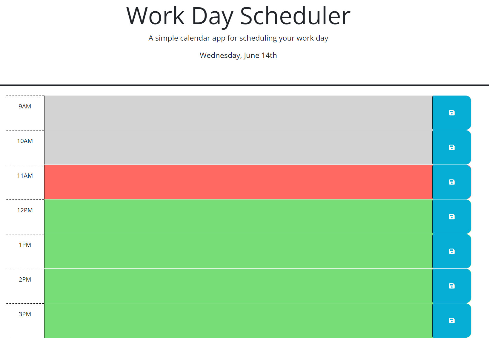

# didactic-octo-spork-module-05-challenge
Module 05 Challenge

## Description

This web application is a work day scheduler.  It allows the user to add events to hour blocks within a work day and save those events.  The current hour will be displayed in red.  Hours that have past will be displayed in gray.  Upcoming hour time blocks will be displayed in green.

## Installation

N/A

## Usage

The application can be accessed at this URL: 

To add events to a timeblock, type in your event details into the desired hour time block and then click the save button.  The data you enter will be saved and appear on page refresh.  You can enter event details into any number of the time blocks available to have those event details display.

Work day scheduler screenshot:

## Credits

N/A

## License

N/A